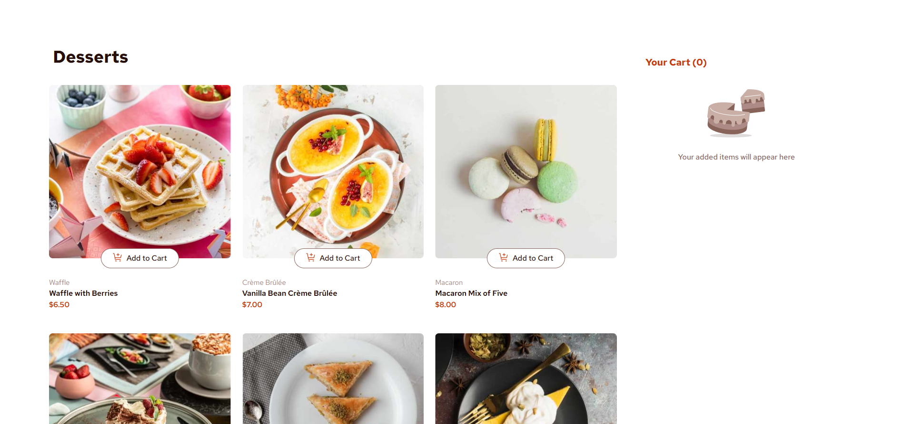
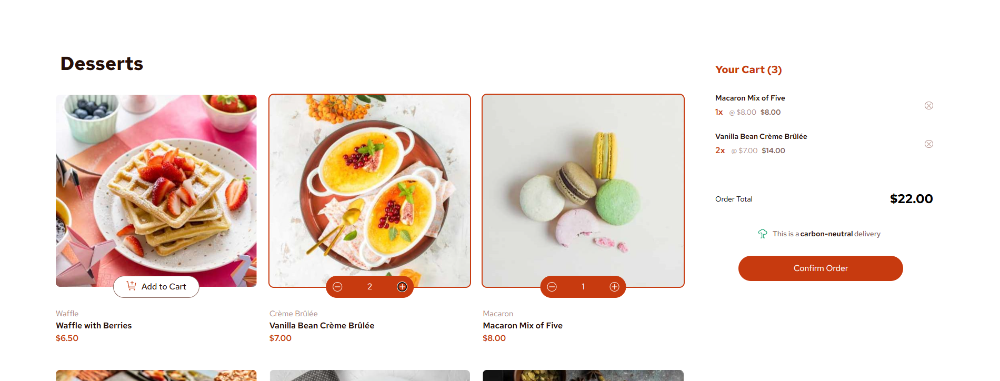
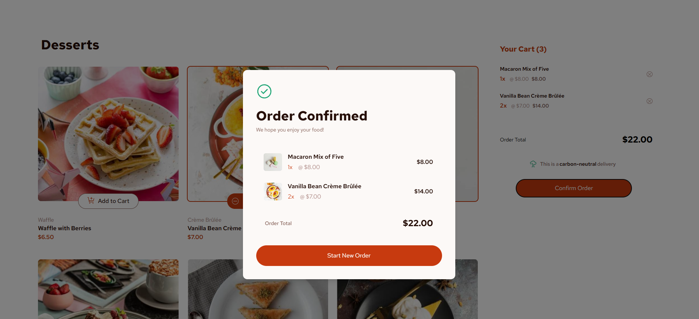
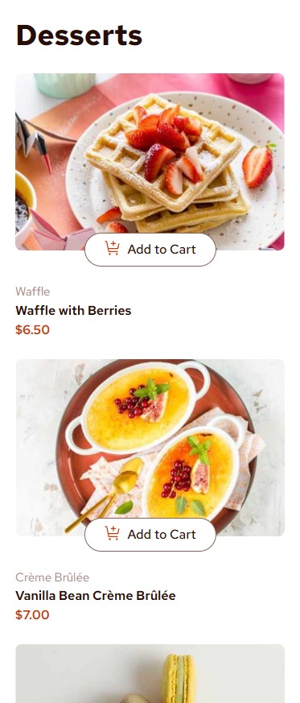
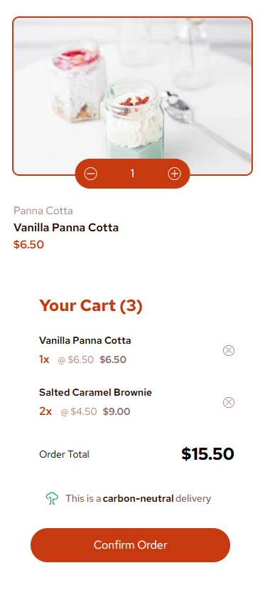
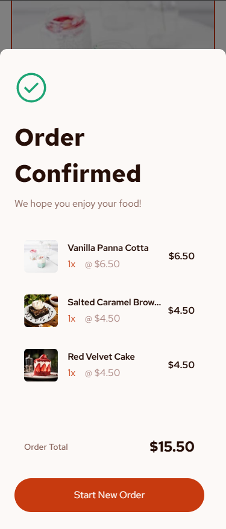

# Frontend Mentor - Product list with cart solution

This is a solution to the [Product list with cart challenge on Frontend Mentor](https://www.frontendmentor.io/challenges/product-list-with-cart-5MmqLVAp_d). Frontend Mentor challenges help you improve your coding skills by building realistic projects.

## Table of contents

- [Frontend Mentor - Product list with cart solution](#frontend-mentor---product-list-with-cart-solution)
  - [Table of contents](#table-of-contents)
  - [Overview](#overview)
    - [The challenge](#the-challenge)
    - [Screenshot](#screenshot)
    - [Links](#links)
    - [Built with](#built-with)
  - [Author](#author)

## Overview

The challenge and challenge assets and design images were provided by Frontend Mentor. The goal is to create your own version of the challenge as close as possible the design images provided.

### The challenge

Users should be able to:

- Add items to the cart and remove them
- Increase/decrease the number of items in the cart
- See an order confirmation modal when they click "Confirm Order"
- Reset their selections when they click "Start New Order"
- View the optimal layout for the interface depending on their device's screen size
- See hover and focus states for all interactive elements on the page

### Screenshot

### Links

- Solution URL: [Frontend Mentor](https://www.frontendmentor.io/solutions/product-list-with-cart-solution-fJuJ2brZ81)
- Live Site URL: [GitHub Live Page](https://friedaxons.github.io/product-list-with-cart/)

### Built with

- [React](https://reactjs.org/) - JS library
- TypeScript
- Tailwind
- Vite

## Author

- Website - [FriedAxons](https://github.com/FriedAxons)
- Frontend Mentor - [@FriedAxons](https://www.frontendmentor.io/profile/FriedAxons)
